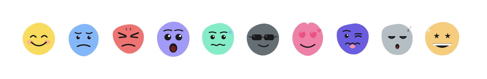

# mood-blobs



Expressive SVG blob components representing different moods for React.

```tsx
<MoodBlob mood="happy" size="m" />
<MoodBlob mood="angry" size="l" color="#FF6B6B" />
```

## Features

- 10 hand-crafted moods with unique blob shapes and expressive faces
- Fully typed with TypeScript
- Zero dependencies (besides React)
- Scales to any size via SVG
- Customizable colors

## Moods

`happy` · `sad` · `angry` · `surprised` · `nervous` · `cool` · `love` · `disgusted` · `sleepy` · `excited`

## Installation

```bash
npm install mood-blobs
```

Requires `react >= 17` as a peer dependency.

## Usage

```tsx
import { MoodBlob } from 'mood-blobs';

// Basic
<MoodBlob mood="happy" />

// With size
<MoodBlob mood="sad" size="l" />

// With custom color
<MoodBlob mood="angry" size="m" color="#FF6B6B" />

// With className / style
<MoodBlob
  mood="excited"
  size="xl"
  style={{ filter: 'drop-shadow(0 4px 12px rgba(0,0,0,0.15))' }}
/>
```

## Props

| Prop        | Type            | Default      | Description                              |
|-------------|-----------------|--------------|------------------------------------------|
| `mood`      | `Mood`          | **required** | The emotional expression to render       |
| `size`      | `Size`          | `"m"`        | `xs`=80px · `s`=120px · `m`=160px · `l`=220px · `xl`=300px |
| `color`     | `string`        | mood default | Any valid CSS color string               |
| `className` | `string`        | —            | Added to the root `<svg>` element        |
| `style`     | `CSSProperties` | —            | Inline styles on the root `<svg>`        |

## Default colors

```ts
happy:     '#FFD93D'  // bright yellow
sad:       '#74B9FF'  // sky blue
angry:     '#FF6B6B'  // coral red
surprised: '#A29BFE'  // lavender
nervous:   '#55EFC4'  // mint
cool:      '#636E72'  // slate gray
love:      '#FD79A8'  // pink
disgusted: '#6C5CE7'  // purple
sleepy:    '#B2BEC3'  // light gray-blue
excited:   '#FDCB6E'  // warm orange
```

## Project structure

```
mood-blobs/
├── src/                    # Library source (the npm package)
│   ├── index.ts
│   ├── types.ts
│   ├── constants.ts
│   └── components/
│       ├── MoodBlob.tsx
│       └── moods/          # One file per mood
│           ├── Happy.tsx
│           ├── Sad.tsx
│           ├── Angry.tsx
│           ├── Surprised.tsx
│           ├── Nervous.tsx
│           ├── Cool.tsx
│           ├── Love.tsx
│           ├── Disgusted.tsx
│           ├── Sleepy.tsx
│           └── Excited.tsx
├── website/                # Static documentation site
│   ├── index.html
│   └── styles.css
└── README.md
```

## Running the demo

```bash
npm install
npm run demo
```

## Building the library

```bash
npm install
npm run build
```

This outputs CommonJS and ESM builds to `dist/`.

## License

MIT
